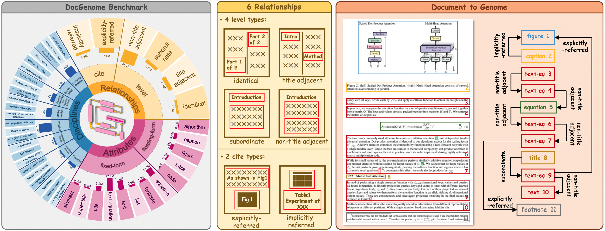

# DocGenome: A Large Benchmark for Multi-Modal Language Models in Real-World Academic Document Understanding

We present DocGenome, a structured document dataset constructed by annotating 500K scientific documents from 153 disciplines in the arXiv open-access community, using our custom auto-labeling pipeline DocParser. DocGenome features four characteristics:

- 1) Completeness: It is the first dataset to structure data from all modalities including 13 layout attributes along with their \LaTeX\ source codes. 
- 2) Logicality: It provides 6 logical relationships between different entities within each scientific document. 
- 3) Diversity: It covers various document-oriented tasks, including document classification, visual grounding, document layout detection, document transformation, open-ended single-page QA and multi-page QA.  
- 4) Correctness: It undergoes rigorous quality control checks conducted by a specialized team. 

## 👇🏻DocGenome-train Download

  [DocGenome-train](https://drive.google.com/drive/folders/1OIhnuQdIjuSSDc_QL2nP4NwugVDgtItD?usp=sharing)

## File Structure
Please refer to [Dataset_Details_README](Dataset_Details_README.md) for the detalied explanation about the different file structures in DocGenome.

## DocGenome Benchmark Introduction

| Datasets                | \# Discipline | \# Category of Units  | \# Pages in Train-set       | \# Pages in Test-set | \# Task    | \# Used Metric | Publication | Entity Relations          |
|------------------------------------------|--------------------------------|-----------------|--------------------|--------------|------------|--------------------|-------------|-----------------|
|                                          |                      
| DocVQA         | -                              | N/A             | 11K                | 1K           | 1          | 2                  | 1960-2000   | ❎     |
| DocLayNet | -                              | 11              | 80K                | 8K           | 1          | 1                  | -           | ❎     |
| DocBank            | -                              | 13              | 0.45M              | **50K** | 3          | 1                  | 2014-2018   | ❎     |
| PubLayNet   | -                              | 5               | 0.34M              | 12K          | 1          | 1                  | -           | ❎     |
| VRDU               | -                              | 10              | 7K                 | 3K           | 3          | 1                  | -           | ❎     |
| DUDE             | -                              | N/A             | 20K                | 6K           | 3          | 3                  | 1860-2022   | ❎     |
| D^4LA             | -                              | **27**    | 8K                 | 2K           | 1          | 3                  | -           | ❎     |
| Fox Benchmark       | -                              | 5               | N/A (No train-set) | 0.2K         | 3          | 5                  | -           | ❎     |
| ArXivCap        | 32                             | N/A             | 6.4M*           | N/A          | 4          | 3                  | -           | ❎    |
| DocGenome (ours)                | **153**                   | 13              | **6.8M**      | 9K           | **7** | **7**         | 2007-2022   | ✅     |
